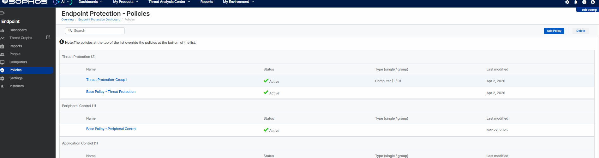
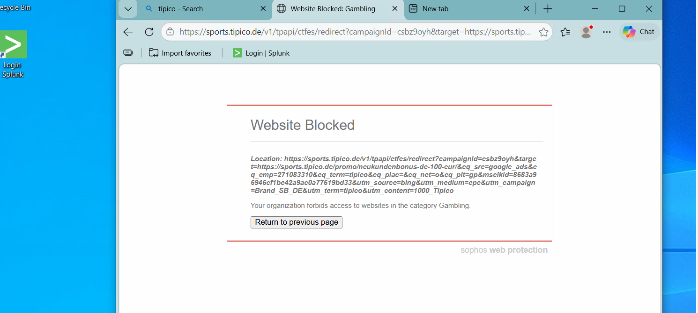
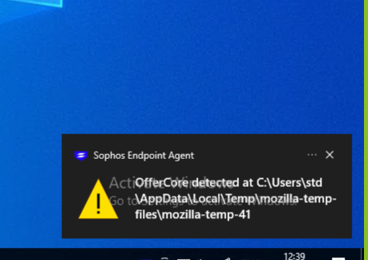
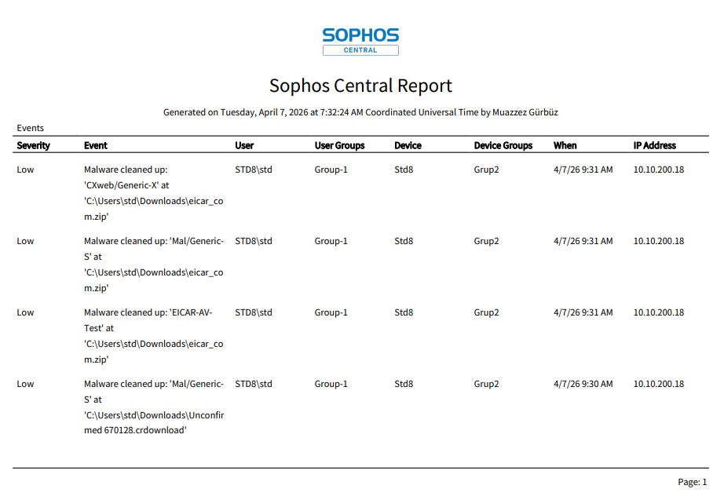
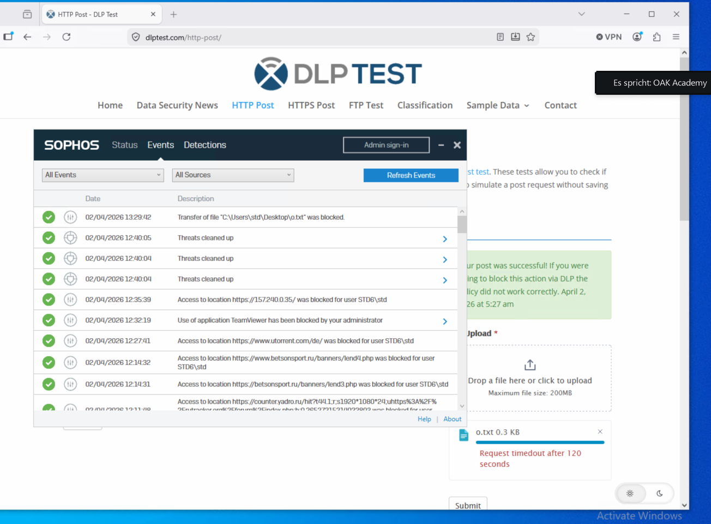
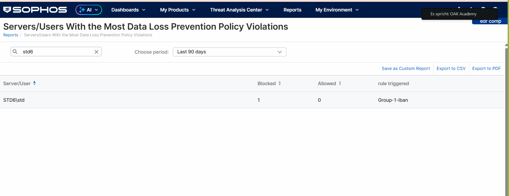

# Sophos EDR Implementation & Threat Analysis

**2-week hands-on security project** — deployed, configured, and stress-tested Sophos Endpoint Detection & Response (EDR) across a lab environment, then investigated a simulated live intrusion end-to-end.

`Endpoint Security` `Threat Detection` `Incident Response` `Malware Analysis` `Threat Hunting` `DLP` `Zero Trust Controls` `CyberChef` `Sophos Central`

---

## What I Did

| Phase | Action | Result |
|---|---|---|
| **Deployment** | Installed Sophos Endpoint Agent on workstations & servers via Sophos Central | Stable centralized management confirmed |
| **Threat Protection** | Custom policy to auto-block malware & ransomware | EICAR test file detected, blocked & cleaned instantly |
| **Web Control** | Custom policy restricting Gambling, Social Media, P2P categories | Access attempts blocked and logged; validated via weekly Web Control report |
| **Application Control — Block** | Blocked unauthorized apps: TeamViewer (remote access), uTorrent (P2P) | Execution attempts confirmed blocked |
| **Application Control — Monitor** | Set a non-critical test app (e.g. Opera) to *Monitor* instead of *Block* | Confirmed app ran successfully while Sophos still logged an "Application detected" event — validated the difference between detection-only and enforcement policy actions |
| **DLP** | Policy blocking upload of files containing sensitive keywords (national ID, credit card numbers) via browser | Tested by uploading a .txt file with sample data to a webmail/file-hosting site — upload blocked |
| **Incident Response** | Located the high-priority alert generated by the EICAR test, then manually isolated the affected workstation from Sophos Central | Confirmed full network isolation while retaining Sophos Central connectivity |
| **Threat Hunting (Live Discover)** | Ran Sophos Query Library queries on a clean endpoint: *"Processes with an open network connection"* and *"Applications in the startup section of the registry"* | Reviewed results for suspicious entries and documented findings |
| **Reporting** | Compiled final report: Live Query findings, Weekly Web Control report, policy/blocking event summaries | Delivered as structured documentation for stakeholders |

## Incident Response Case Study: Host "Std30"

SOC monitoring flagged abnormal activity on a Windows host. Investigated a suspected backdoor with encrypted command execution and persistence — using **Sophos Live Discover** for triage and **CyberChef** for payload decoding:

- **Discovery:** Identified a suspicious running process and decoded its encrypted command line using CyberChef
- **Delivery:** Traced the decoded command to the attacker's source IP (`10.10.200.51`, lab network), the malware's disguised filename (`sysupdate.exe`), and its drop location (`C:\Temp`)
- **Command & Control:** Identified port `4444` as the listener the malware used for inbound attacker connections
- **Persistence:** Found the Registry Run key (`WindowsSysUpdater` under `HKLM\Software\Microsoft\Windows\CurrentVersion\Run`) the attacker created for auto-execution on reboot

## Key Takeaways

- Understanding the difference between *Block* and *Monitor* policy actions is critical — Monitor mode still gives full visibility without disrupting business-critical workflows
- Centralized policy management + logging significantly sped up incident triage
- Policies needed per-system tuning rather than one blanket configuration
- Layered controls (prevention + detection + response) catch what single-point defenses miss

## Evidence (Screenshots)

A small, representative set of screenshots is included below — enough to show each control actually working, without publishing the full policy/event log set.

### Policy Configuration

### Web Control

### Threat Protection

### Data Loss Prevention (DLP)

---

*Project completed as part of OAK Academy's Cybersecurity Engineering program in a controlled training lab environment. Original report written in German; this is an English portfolio summary.*
